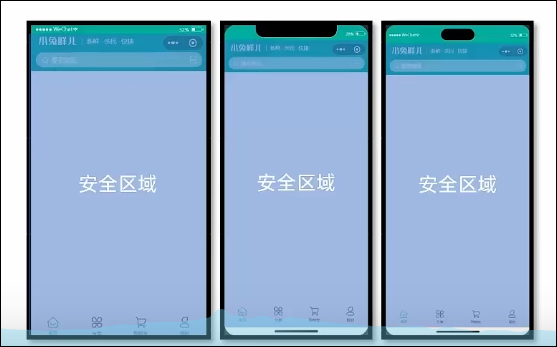

##  安全区域
每一个设备屏幕都有自己显示的安全区域，这也就意味着视口和页面需要一定的平移，例如头帘屏幕，灵动岛屏幕，一般屏幕，每一种屏幕都是自己的安全显示区域，因此需要获取到屏幕的安全区
```

<script setup lang="ts">
const { safeArea } = uni.getWindowInfo()
</script>
```
**safeArea** 的Top 属性就说明这个安全区和视口之间的位置关系



## 通用组件引用

```
		"autoscan": true,
		"custom": {
			// 正则匹配
			"^uni-(.*)": "@dcloudio/uni-ui/lib/uni-$1/uni-$1.vue",
+      "^Xp(.*)": "./components/Xp$1.vue"
		}
```
接下来还需要通过类型指定

```
// /src/components/components.d.ts
declare module '@vue/runtime-core'{
  export interface GlobalCOmponents{
    XpSwiper: typeof XpSwiper
  }
}

```

找到Pages.json
